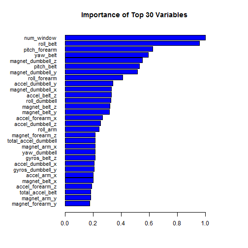
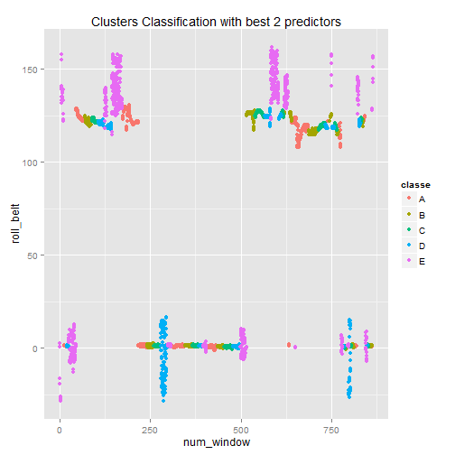
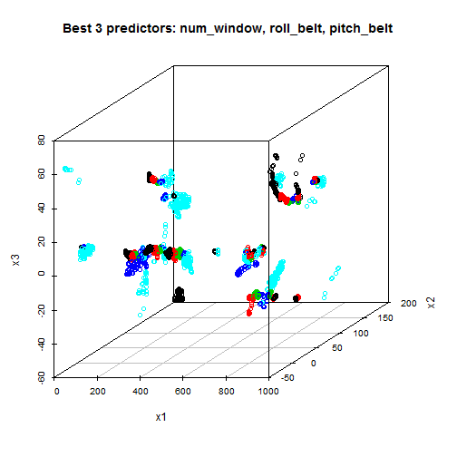

# Practical Machine Learning Course
## Project Write Up
### Jordi Raso

========================================================

### Background

Using devices such as Jawbone Up, Nike FuelBand, and Fitbit it is now possible to collect a large amount of data about personal activity relatively inexpensively. These type of devices are part of the quantified self movement - a group of enthusiasts who take measurements about themselves regularly to improve their health, to find patterns in their behavior, or because they are tech geeks. One thing that people regularly do is quantify how much of a particular activity they do, but they rarely quantify how well they do it. In this project, your goal will be to use data from accelerometers on the belt, forearm, arm, and dumbell of 6 participants. They were asked to perform barbell lifts correctly and incorrectly in 5 different ways. More information is available from the website here: http://groupware.les.inf.puc-rio.br/har (see the section on the Weight Lifting Exercise Dataset). 


### Data 

The training data for this project are available here: 

https://d396qusza40orc.cloudfront.net/predmachlearn/pml-training.csv

The test data are available here: 

https://d396qusza40orc.cloudfront.net/predmachlearn/pml-testing.csv

### Procedure

- **1. Data Manipulation:** Load, tidy data and remove empty or useless columns

- **2. Sampling:** Create Train and Test dataSets from training data for cross validation

- **3. Model building:** Random Forest Model training

- **4. Error estimates:** In-sample and Out-of-sample errors

- **5. Prediction test:** Predict the 20 test cases and generate txt files.

### 1. Data Manipulation:


```r
# Load libraries
library(caret)
```

```
## Loading required package: lattice
## Loading required package: ggplot2
```

```r
library(randomForest)
```

```
## randomForest 4.6-10
## Type rfNews() to see new features/changes/bug fixes.
```

```r
# Set working directory where datasets have been downloaded
setwd("C:/Users/Jordi/Desktop/CURSOS/Prac_Machine_Learning/Peer_assessment")

# Insert data to data.frames
trainSet<-read.csv("pml-training.csv")
testSet<-read.csv("pml-testing.csv")
set.seed(345) # to allow reproducibility

# Some exploratory work
# head(trainSet)
# summary(trainSet)

# eliminate first 6 columns
trainSet <- trainSet[, 6:dim(trainSet)[2]]

#Remove columns with > 70% of NA or "" values
threshold <- dim(trainSet)[1] * 0.70
goodColumns <- !apply(trainSet, 2, function(x) sum(is.na(x)) > threshold  || sum(x=="") > threshold)
trainSet <- trainSet[, goodColumns]

#Remove columns with near Zero values
badColumns <- nearZeroVar(trainSet, saveMetrics = TRUE)
trainSet <- trainSet[, badColumns$nzv==FALSE]
```

### 2. Sampling:


```r
# create training set indexes with 1% of data for fast exploratory preprocess in my netbook
#inTrain <- createDataPartition(y=trainSet$classe,p=0.10, list=FALSE)
# create training set indexes with 25% of data instead of 75%, for easy process in my netbook
inTrain <- createDataPartition(y=trainSet$classe,p=0.25, list=FALSE)
# over 25%, predicted results to be submited do not change on the test Set

# subset data to training and the rest to test
training <- trainSet[inTrain,]
testing <- trainSet[-inTrain,]

#Assuring that variable classe is treated as factor
training$classe<-as.factor(training$classe)
testing$classe<-as.factor(testing$classe)
```

### 3. Model building:


```r
# Use randomForest() instead of train(,method="rf") for faster processing on my netbook
model <- randomForest(classe ~ ., data = training)
varImpObj <- varImp(model)
```


```r
# Top 30 plot
sorted<-order(varImpObj[,1],decreasing=F)
y<-(varImpObj[sorted,1]/max(varImpObj[,1]))[24:53]
namesVar<-(rownames(varImpObj)[sorted])[24:53]
par(mar = c(5,9,4,6))
bar.y<-barplot(y,main = "Importance of Top 30 Variables",las=1,horiz=T,names.arg=namesVar, col="blue",space=.2,cex.names=.9)
```

 


```r
p1 <- qplot(num_window,roll_belt,colour=classe,data=training) +
ggtitle("Clusters Classification with best 2 predictors")
library(scatterplot3d)
p1
```

 

```r
x1<-training$num_window
x2<-training$roll_belt
x3<-training$pitch_belt
clascol<-as.integer(training$classe)

scatterplot3d(x1,x2,x3,color=clascol,main="Best 3 predictors: num_window, roll_belt, pitch_belt")
```

 


### 4. Error estimates:


```r
# In-train error estimates
confusionMatrix(training$classe,predict(model,training))
```

```
## Confusion Matrix and Statistics
## 
##           Reference
## Prediction    A    B    C    D    E
##          A 1395    0    0    0    0
##          B    0  950    0    0    0
##          C    0    0  856    0    0
##          D    0    0    0  804    0
##          E    0    0    0    0  902
## 
## Overall Statistics
##                                      
##                Accuracy : 1          
##                  95% CI : (0.9992, 1)
##     No Information Rate : 0.2843     
##     P-Value [Acc > NIR] : < 2.2e-16  
##                                      
##                   Kappa : 1          
##  Mcnemar's Test P-Value : NA         
## 
## Statistics by Class:
## 
##                      Class: A Class: B Class: C Class: D Class: E
## Sensitivity            1.0000   1.0000   1.0000   1.0000   1.0000
## Specificity            1.0000   1.0000   1.0000   1.0000   1.0000
## Pos Pred Value         1.0000   1.0000   1.0000   1.0000   1.0000
## Neg Pred Value         1.0000   1.0000   1.0000   1.0000   1.0000
## Prevalence             0.2843   0.1936   0.1744   0.1638   0.1838
## Detection Rate         0.2843   0.1936   0.1744   0.1638   0.1838
## Detection Prevalence   0.2843   0.1936   0.1744   0.1638   0.1838
## Balanced Accuracy      1.0000   1.0000   1.0000   1.0000   1.0000
```

```r
# Out-of-train error estimates
confusionMatrix(testing$classe,predict(model,testing))
```

```
## Confusion Matrix and Statistics
## 
##           Reference
## Prediction    A    B    C    D    E
##          A 4183    0    0    1    1
##          B   23 2819    5    0    0
##          C    0   20 2540    6    0
##          D    0    0   54 2349    9
##          E    0    0    3   12 2690
## 
## Overall Statistics
##                                           
##                Accuracy : 0.9909          
##                  95% CI : (0.9892, 0.9924)
##     No Information Rate : 0.2858          
##     P-Value [Acc > NIR] : < 2.2e-16       
##                                           
##                   Kappa : 0.9885          
##  Mcnemar's Test P-Value : NA              
## 
## Statistics by Class:
## 
##                      Class: A Class: B Class: C Class: D Class: E
## Sensitivity            0.9945   0.9930   0.9762   0.9920   0.9963
## Specificity            0.9998   0.9976   0.9979   0.9949   0.9988
## Pos Pred Value         0.9995   0.9902   0.9899   0.9739   0.9945
## Neg Pred Value         0.9978   0.9983   0.9949   0.9985   0.9992
## Prevalence             0.2858   0.1929   0.1768   0.1609   0.1835
## Detection Rate         0.2843   0.1916   0.1726   0.1596   0.1828
## Detection Prevalence   0.2844   0.1935   0.1744   0.1639   0.1838
## Balanced Accuracy      0.9972   0.9953   0.9870   0.9934   0.9975
```

From these results, it can be seen that the model accuracy in the testing data is near 99%, even though only the 25% of the training dataset has been used to train the Random Forest model.

A total of 53 predictors have been used, but there are two very significant and 8 important, as can be seen on the barplot.

### 5. Prediction test:


```r
# Predict 20 testSet data and
# create submission files with code provided

pml_write_files = function(x){
        n = length(x)
        for(i in 1:n){
                filename = paste0("problem_id_",i,".txt")
                write.table(x[i],file=filename,quote=FALSE,row.names=FALSE,col.names=FALSE)
        }
}
x <- testSet

answers <- predict(model, newdata=x)
answers
```

```
##  1  2  3  4  5  6  7  8  9 10 11 12 13 14 15 16 17 18 19 20 
##  B  A  B  A  A  E  D  B  A  A  B  C  B  A  E  E  A  B  B  B 
## Levels: A B C D E
```

```r
#pml_write_files(answers)
```


